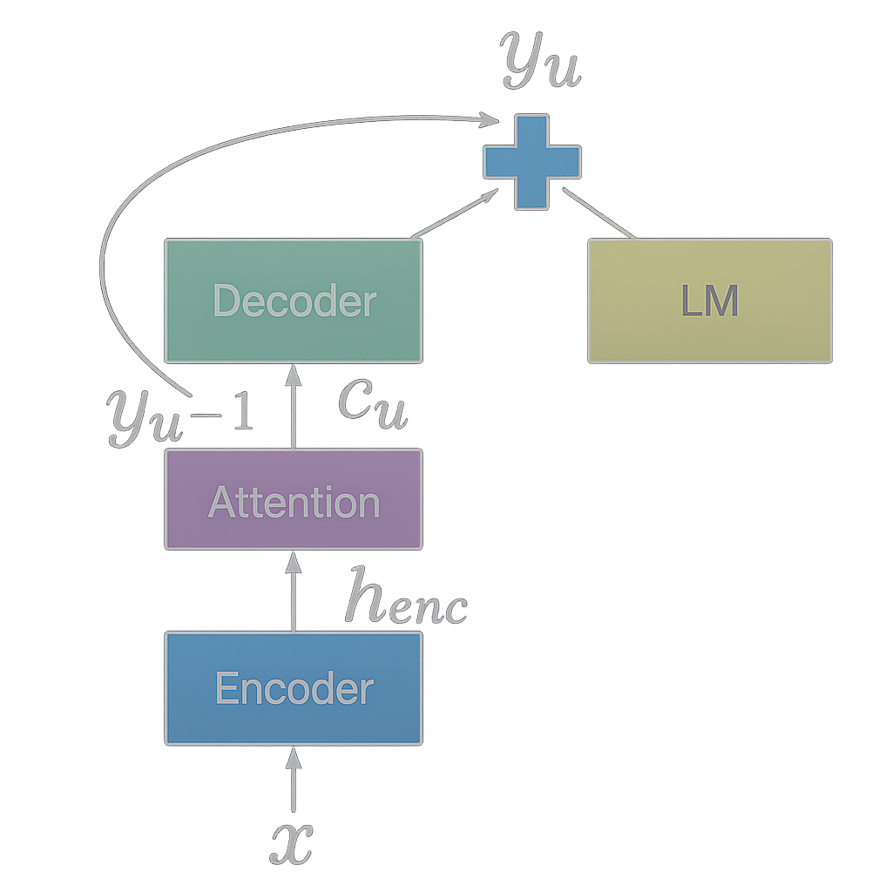

# 🔗 Shallow Fusion: Bridging Data Scarcity and AI Integration Challenges 

**COLLINS WESTNEDGE**  
*AUGUST 26, 2025*

## Introduction
AI adoption and integration have become focal points in seemingly every earnings call, linkedin post, townhall and industry keynote. However, most of these conversations exist to highlight revenue potential, promote products and services, or bolster positive consumer sentiment, which is likely why they tend to gloss over or abstract away the technical challenges that stand in the way of effective adoption. One of the fundamental challenges is the gap between available data and the data needed for a domain-specific task. 

Consider for example applying a large generalist model to a highly specialized task that barely surfaces in its pretraining data if at all. For the generalist model to succeed, it must first grasp dense company prospectuses, specialized jargon, and the nuances of the business problem itself. To address this gap companies often resort to standard recipes e.g. "exciting" the right activations through few-shot examples, dumping streams of internal documents into the model's context, or ambitious attempts at fine-tuning on small internal datasets. However, with most of these approaches there's often no optimization signal, or gradient to move against and progress if there's any to be had involves a good deal of guesswork, trial, and error. 

**Automatic Speech Recognition (ASR)** exemplifies this challenge. Many domains, such as medicine, law, financial services, etc contain specialized terminology that is typically outside the distribution or under-represented in the pretraining for general purpose models. A model trained on everyday speech will struggle with phrases like "orthostatic tachycardia" or specialized phonemes that are difficult to disambiguate, such as "ICU" vs "I see you". Traditional solutions to this issue involve collecting domain-specific audio and ground truth transcriptions (often hand labeled) which can be cost prohibitive. Open source datasets on specialized domains are becoming more common but their volume and variety remain limited, keeping them tangential to many business use cases.

This distribution gap has motivated researchers and practitioners (myself included) to explore the concept of **shallow fusion**: combining general-purpose ASR models with domain-specific language models during inference. Rather than requiring extensive retraining, shallow fusion leverages existing domain expertise from an external language model at inference time. While the approach has shown promise in various implementations, the questions I would like to explore in this article are: Can a language model trained on domain-specific text meaningfully improve speech-to-text transcription quality within an adjacent domain? And critically, what are the failure modes associated with this type of integration?

## Background & Existing Approaches

The challenge of domain adaptation in ASR has prompted several approaches, each with distinct trade-offs in cost, performance, and implementation complexity. Before diving into my implementation, I'll examine how the research community has approached this domain mismatch problem and where shallow fusion fits among existing solutions.

**Traditional domain adaptation** typically requires collecting domain-specific audio paired with ground truth transcriptions, then fine-tuning pretrained models on this data. While effective, this approach faces significant barriers: domain-specific audio is expensive to collect, transcription labeling is labor-intensive, and the resulting datasets often remain small and brittle compared to the large scale datasets that the base model was trained on. This approach also runs the risk of catastrophic forgetting[^1], where the model loses its general capabilities when adapting to the specific domain.

**Context injection methods** attempt to bridge the gap by incorporating domain-specific text directly into the model's context window, essentially "prompting" the ASR system with relevant terminology. However, these approaches offer no optimization signal and rely heavily on trial and error to achieve meaningful improvements. They are also architecture dependent and rely on the decoder's prompting capacity, which may be limited in models not explicitly designed for such conditioning.

**Fusion techniques** represent a middle ground, combining predictions from multiple models during inference rather than requiring extensive retraining. The research community has explored three primary variants:

- **Shallow fusion** combines model predictions at inference time via a weighted average of ASR and LM scores, requiring no additional training [(Gulcehre et al., 2015)](https://arxiv.org/pdf/1503.03535). 

- **Deep fusion** augments the decoder with a small gating network that learns to merge hidden representations from the ASR and LM while keeping both models frozen [(Gulcehre et al., 2015)](https://arxiv.org/pdf/1503.03535).  

- **Cold fusion** incorporates a pretrained LM directly into ASR training—projecting the LM’s probability distribution into a shared embedding space and using gating layers—letting the ASR internalize linguistic knowledge early. This improves convergence and domain adaptation at the cost of greater training complexity [(Sriram et al., 2017)](https://arxiv.org/pdf/1708.06426).  

Shallow fusion's appeal lies in its simplicity and flexibility, as it requires no additional training of the base ASR model. Instead, you incorporate predictions from an external language model directly at inference time, blending the acoustic model's view of the audio with the language model's understanding of domain-specific text. Importantly, the only data needed to build or adapt the external language model is unstructured text, which can be collected far more easily than transcribed audio and used in a self-supervised training setup.

However, the approach introduces its own challenges. If the language model is weighted too heavily, it may bias transcriptions toward plausible but incorrect tokens; too lightly, and the domain benefits are lost. Tuning the weighting factor for the external model often requires domain-specific adjustment. In addition, shallow fusion increases inference cost since predictions must run through a second model[^2]. These trade-offs make it essential to understand the method's failure modes before deploying it in practice.

## Implementation: Medical Domain Fusion Pipeline

Having established the landscape of existing approaches, we can now detail the implementation of shallow fusion for medical ASR, combining Whisper with a domain-adapted GPT-2 model. However, before going into the specifics let us first build some intuition on the topic by analogy. 

Consider for example, a person tasked with transcribing audio from a phone call between a customer and a claims representative at an insurance call center. This transcriber can hear the conversation clearly, but they have very little knowledge of the domain e.g. the technical issues, procedures, and medical terminology that often come up. Now imagine a second person who has worked in this industry for years and has deep familiarity with the jargon and context, but who is hard of hearing.

In practice, the first person might hear a phrase like "myocardial infarction" but misrecognize or misspell it. The domain expert, although unable to hear the audio, would immediately recognize the intended term and correct the transcript.

Shallow fusion can be thought of as a process of integrating each person's expertise to offset the errors of one another and bridge modalities the other does not have access to. With this analogy we can now formally describe this process. In the example below think of $P_{\text{ASR}}$ as the person listening to the audio and $P_{\text{LM}}$ as the domain expert that is hard of hearing but deeply understands the context. 

### Mathematical Formulation

At each decoding step for some audio input, we select the most probable token $y_{t}$ using information from the Automatic Speech Recognition model (ASR) and the Language Model (LM)

$$
y^* = \arg\max_{y_t}\;
\left[
\log P_{\text{ASR}}\!\bigl(y_t \mid x,\, y_{<t}\bigr)
\;+\;
\lambda\,\log P_{\text{LM}}\!\bigl(y_t \mid y_{<t}\bigr)
\right]
$$

where:  
- $t$ is the decoding step (0-based).  
- $y_t$ is the chosen token at step $t$ and $y_{<t}$ are previously generated tokens.  
- $x$ represents the acoustic features (e.g. raw audio input).  
- $P_{\text{ASR}}$ depends on both $x$ and $y_{<t}$, while $P_{\text{LM}}$ depends on $y_{<t}$ only.  
- $\lambda$ is the weighting factor to determine the language model's influence.

The idea is that the ASR model understands phonetics and language in a general sense while the LM model understands the specialized domain in its written form, but has no access to the audio signal. Just like in the analogy from earlier by fusing their predictions, we combine phonetic understanding with domain expertise, aiming to improve the quality of transcriptions for domain specific terms. Without careful integration or synergy between the two, both models can carry major limitations.

#### Process Diagram:

Reference: [Kannan et al. 2017](https://arxiv.org/pdf/1712.01996)

Consider an example where Whisper serves as our listening expert and GPT-2 as our domain-language expert. In practice these models share a tokenizer making the process of integrating their predictions fairly seamless at least for the english version of Whisper ([Radford 2.2](https://arxiv.org/pdf/2212.04356)). Now let's consider a claims call center transcript where an ASR model misinterprets a specialized medical term. 

**Input Audio (Ground Truth):**  
"The procedure was medically necessary for the treatment of claimant's Tetralogy of `Fallot`."✔️

**Whisper Initial Output:**  
"The procedure was medically necessary for the treatment of claimant's Tetralogy of `below`."🚫

#### 1. **Whisper Initial Decoding:**

Whisper produces logits at each step:

- Token: "The" → high confidence  
- Token: "procedure" → high confidence  
- Token: "claimant" → high confidence  
- Token: "'s" → high confidence  
- At the final subword, Whisper may exhibit uncertainty, spreading probabilities across candidates: "below", "follow", "Fallot"

#### 2. **Domain GPT-2 Predictions:**  
At this ambiguous decoding step, GPT-2 (the domain-adapted LM) produces logits based on the following context:

- "The procedure was medically necessary for the treatment of claimant's Tetralogy of `_____`"

- GPT-2 which has been fine tuned on medical literature strongly favors the correct token (produces log probabilities closer to 0 for Fallot) while Whisper, which had minimal access to medical terminology, assigns it a much lower likelihood (log probabilities that are more negative).

| Next Token   | Whisper Log Probs | GPT-2 Log Probs |
|--------------|------------------|-----------------|
| **Fallot** | **–1.8**         | **–0.3**        |
| below      | –1.0             | –5.0            |
| follow        | –3.5             | –3.8            |

#### 3. **Shallow Fusion (Combining Logits):**  
We combine each model's logits using a weighted sum in the following way:

$$
\log P_{\text{combined}}\bigl(y_t\bigr)
  = \log P_{\text{Whisper}}\bigl(y_t \mid x,\, y_{<t}\bigr)
  + \lambda\,\log P_{\text{GPT2}}\bigl(y_t \mid y_{<t}\bigr)
$$

| Next Token   | Whisper Score | GPT-2 Score | Combined Score (λ = 0.2)|
|--------------|--------------|-------------|----------------|
| **Fallot** | **–1.8**     | **–0.3**    | **–1.8 + 0.2 × (–0.3) = –1.86** |
| below      | –1.0         | –5.0        | –1.0 + 0.2 × (–5.0) = –2.0 |
| follow        | –3.5         | –3.8        | –3.5 + 0.2 × (–3.8) = –4.26 |

> *Note: The numbers here are illustrative. In practice additional context and scaling would favor the correct token "Fallot"; additionally, rare words are likely split into multiple tokens but the intuition remains the same.*

"Fallot" now has the highest combined score.

**Final Corrected Output:**  
"The procedure was medically necessary for the treatment of claimant's Tetralogy of `Fallot`."✔️

This demonstrates how **domain-aware shallow fusion** can significantly improve ASR output in specialized contexts.

## Experimental Setup

### Model Selection and Preparation

For this implementation, I chose **Whisper** as the base ASR model due to its strong general-purpose performance and **GPT-2** as the domain-specific language model. The external model selected for this fusion process was GPT-2 small, medium, and large. The reason for selecting this model was partly due to convenience, because pre-trained versions are widely available and they share a tokenizer/vocabulary with Whisper's decoder. The shared vocabulary means we do not have to learn a mapping from one model's vocabulary to another.

While Bio-GPT represents an existing medical language model, it uses a different tokenizer that would require learning a mapping function between tokenization schemes. To avoid potential errors and implementation complexity, I opted to train custom GPT-2 variants on medical data while preserving Whisper's tokenizer compatibility.

### Training Domain-Specific Language Models

In order to adapt an external language model to the medical domain, the PubMed dataset was used. For adapting we tuned GPT-2 small, medium, and large on roughly **3.63 billion tokens** from PubMed abstracts. I trained three GPT-2 variants to create domain-adapted language models:
- **GPT-2 Small** (117M parameters)
- **GPT-2 Medium** (345M parameters) 
- **GPT-2 Large** (774M parameters)

The models were trained using standard autoregressive language modeling objectives on this large corpus of medical abstracts. By maintaining Whisper's tokenizer throughout training, I ensured seamless integration during the fusion process without requiring token mapping or vocabulary alignment procedures.

**Training pipeline and tuned models:**

- [View on GitHub](https://github.com/donkeyanaphora/SHALLOW_FUSION)  
- [Hugging Face Models](https://huggingface.co/cwestnedge/models)  

### Fusion Pipeline Architecture

The fusion pipeline operates selectively on relevant tokens only. Whisper contains special task-related tokens (language identifiers, task specifiers, timestamps) that are outside the scope of GPT-2's vocabulary and training domain. However, for the English transcription task, Whisper should not emit these special tokens during normal operation, making this a non-issue in practice.

The implementation performs fusion by:
1. Running Whisper's encoder to generate audio features
2. At each decoding step, computing logit distributions from both Whisper's decoder and the domain-adapted GPT-2
3. Combining logits using the weighted sum formulation described earlier
4. Selecting tokens based on the fused probability distribution

### Evaluation Framework

Testing was conducted on a proof-of-concept dataset consisting of synthetic radiology report dictations. While ideally evaluation would occur on authentic clinical dictations, access to such datasets typically requires institutional permissions and agreements. To generate the synthetic dataset, I prompted a language model to create realistic radiology report dictations that mirror the style, terminology, and content patterns found in actual clinical documentation.

The primary evaluation metric was Word Error Rate (WER), comparing transcriptions from:
- Whisper-only baseline
- Shallow fusion with various λ weighting values
- Different GPT-2 model sizes (small, medium, large)

## Results & Analysis

### Overall Performance

The shallow fusion approach reduced Word Error Rate from **8.24%** to **7.00%** on the synthetic radiology dataset—a **1.24-point absolute drop**, corresponding to a **15% relative reduction in errors**.[^3] Overall observed results are consistent with prior work. For example, Kannan et al. (2017) reported a **9.1% relative WER reduction** on Google Voice Search using shallow fusion with a neural LM [(Kannan et al., 2017)](https://arxiv.org/pdf/1712.01996).

### Performance Analysis by Model Size

Testing across GPT-2 variants revealed interesting scaling properties:
- **GPT-2 Small**: Provided baseline domain improvements with minimal computational overhead
- **GPT-2 Medium**: Achieved the optimal balance of accuracy gains and inference speed
- **GPT-2 Large**: Marginal additional accuracy improvements but with significantly increased computational cost

The medium-sized model emerged as the practical sweet spot, offering most of the fusion benefits without the computational penalty of the largest variant.

### Error Pattern Analysis and Failure Modes

While the overall WER improvement was encouraging, analysis revealed specific failure modes that illuminate the method's limitations:

**1. Abbreviation Expansion Mismatches**
The fusion system frequently "over-corrected" spoken abbreviations into their formal written equivalents. For example:
- Audio: "centimeters" → Whisper: "centimeters" → Fused output: "cm"
- This reflects the domain language model's bias toward written medical documentation style

**2. Punctuation Insertion**
The GPT-2 model, trained on formatted medical abstracts, introduced punctuation that wasn't present in the spoken audio. This created a stylistic mismatch between transcribed speech and formal written medical language.

**3. Premature Termination and Incomplete Transcripts**  
When λ (the LM weight) was set too high, beam search decoding often produced incomplete transcripts. Chorowski & Jaitly (2016) reported that external LMs can cause seq2seq systems to skip words or drop parts of an utterance during decoding, unless a coverage term is added to the beam search criterion [(Chorowski & Jaitly, 2016)](https://arxiv.org/pdf/1612.02695). In our experiments, higher λ coupled with wide beam searches similarly led to premature terminations, with the LM assigning high probability to end-of-sequence tokens once a transcript appeared semantically complete, even while audio continued.

### Domain-Specific Improvements

The fusion approach's benefits were concentrated almost exclusively in medical terminology recognition. Examples of successful corrections included:
- Complex pharmaceutical names
- Anatomical terminology
- Rare disease names and medical conditions
- Procedural and diagnostic terminology

Standard conversational language showed minimal improvement, confirming that the benefits derive specifically from domain expertise rather than general language modeling enhancement.

### Hyperparameter Sensitivity

The λ weighting factor proved critical to performance. Lower values (λ < 0.1) provided minimal domain benefits, while higher values (λ > 0.5) introduced too many artifacts from the written domain bias. The optimal range fell between 0.12-0.3 for most test cases, though this varied with content complexity and medical terminology density.

## Reflection and Future Directions

### Addressing Current Limitations

The experimental results highlight several areas for improvement that point toward promising future research directions:

**Learned Gating Mechanisms**
The static λ weighting approach represents a significant limitation. A more sophisticated system would dynamically adjust the influence of the external language model based on acoustic confidence and contextual cues. When Whisper exhibits high confidence in its predictions, the domain model should have minimal influence. Conversely, during periods of acoustic uncertainty—particularly around medical terminology—the fusion weight should increase. Implementing this would likely involve training a small gating network that learns to predict optimal λ values given acoustic features and partial transcript context.

**Advanced Fusion Architectures**
Beyond shallow fusion, **deep fusion** and **cold fusion** approaches warrant investigation. Deep fusion could learn more sophisticated integration by combining hidden states and tuning a task specific fusion function. Cold fusion could be explored by integrating the domain language model during Whisper's training process, though this would require more substantial computational resources and training data.

**Real-World Dataset Validation**
The synthetic evaluation dataset, while useful for proof-of-concept demonstration, limits the generalizability of these findings. Future work should incorporate authentic clinical dictations such as those provided by John Snow Labs, which require proper institutional access and permissions. Real clinical speech presents challenges absent in synthetic data: background noise, speaker variations, interruptions, and the full complexity of clinical communication patterns.

### Broader Implications

This work connects to several important trends in contemporary AI development:

**Ensemble and Mixture-of-Experts Architectures**: Shallow fusion represents a simple form of ensemble modeling, where specialized models contribute their expertise to improve overall performance. This aligns with the broader trend toward Mixture-of-Experts architectures that dynamically route inputs to specialized sub-networks.

**Multimodal Integration Challenges**: The fusion of acoustic and textual information highlights fundamental challenges in multimodal AI systems. Different modalities often have distinct statistical properties and optimal representations, requiring careful integration strategies.

**Domain Adaptation Strategies**: As AI systems deploy across increasingly specialized domains, the tension between general capability and domain expertise becomes more pronounced. Shallow fusion offers one approach to leveraging domain-specific knowledge without extensive retraining of large general-purpose models.

## Conclusion

This exploration of shallow fusion for medical ASR demonstrates both the promise and limitations of combining general-purpose models with domain-specific expertise. The key insight is that each model type hits distinct "data walls":

**Whisper (Generalist Model)** excels at acoustic-to-text mapping and handles diverse speakers, accents, and recording conditions effectively. However, its broad training distribution means medical terminology remains under-represented, leading to systematic errors on specialized vocabulary despite strong general performance.

**GPT-2 (Domain Specialist)** trained on PubMed abstracts develops rich representations of medical terminology and context through self-supervised learning on abundant textual data. However, it remains completely blind to acoustic signals and exhibits biases toward formal written language rather than conversational speech patterns.

The 10% WER reduction achieved through shallow fusion validates the core hypothesis: domain-specific language models can meaningfully improve speech recognition in specialized contexts. However, the failure modes—abbreviation mismatches, punctuation insertion, and premature terminations reveal the challenges of bridging modalities with different statistical properties and stylistic conventions.

The observed improvements concentrated almost exclusively on medical terminology recognition, confirming that the benefits derive from genuine domain expertise rather than general language modeling improvements. This specificity, while limiting the approach's broad applicability, makes it particularly valuable for specialized transcription applications where domain terminology accuracy is critical.

Future work toward learned gating mechanisms, advanced fusion architectures, and validation on authentic clinical datasets will help address current limitations. More broadly, this work illustrates the ongoing evolution of AI system architectures from monolithic models toward composite systems that combine specialized expertise, a trend likely to accelerate as AI deployment expands across diverse professional domains.

## Resources
* [On Using Monolingual Corpora in Neural Machine Translation](https://arxiv.org/pdf/1503.03535) — Gulcehre et al., 2015  
* [Cold Fusion: Training Seq2Seq Models Together with Language Models](https://arxiv.org/pdf/1708.06426) — Sriram et al., 2017  
* [Towards Better Decoding and Language Model Integration in Sequence-to-Sequence Models](https://arxiv.org/pdf/1612.02695) — Chorowski & Jaitly, 2016  
* [Analysis of Incorporating an External Language Model…](https://arxiv.org/pdf/1712.01996) — Kannan et al., 2017  
* [Robust Speech Recognition via Large-Scale Weak Supervision](https://arxiv.org/pdf/2212.04356) — Radford et al., 2022  
* [Language Models are Unsupervised Multitask Learners](https://cdn.openai.com/better-language-models/language_models_are_unsupervised_multitask_learners.pdf) — OpenAI, 2019  
* [Language Models are Few-Shot Learners](https://arxiv.org/pdf/2005.14165) — Brown et al., 2020  

[^1]: [Catastrophic forgetting](https://en.wikipedia.org/wiki/Catastrophic_interference) occurs when a neural network loses previously learned information upon learning new tasks or data.

[^2]: Several variations exist to reduce the inference cost of shallow fusion, including N-best rescoring (applying the LM only to candidate transcripts), using smaller or distilled domain LMs etc.

[^3]: The distinction here is between *percentage points* and *percent reduction*. The absolute WER drop is **1.24 points** (8.24 → 7.00). However, since errors fell from 8.24 to 7.00, the system made about **15% fewer errors relative to the baseline**.

[^3]: Relative reduction is computed as (8.24 - 7.00) / 8.24 ≈ 15%.