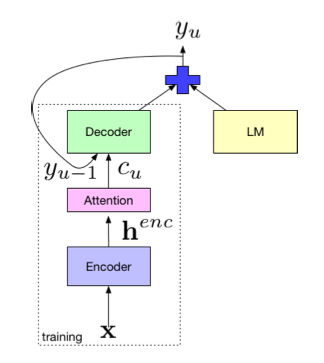

## Introduction
When I first attended NeurIPS (Dec 2023) nearly every pannel discussed or addressed AI ethics and the future of AI. By now these topics infect every Linkedin post, earnings call, and employee town hall, like a bilboard top 10 stagnating the charts well past it's expiration date. 

The merit of these topics is undeniable, but their oversaturation has dulled meaningful discourse, turning urgent discussions into background noise. Yet beneath these trending topics lies a more pressing, subtler issue: the struggle against data scarcity, and the practical complexities surrounding real-world integration of AI.

## The Simple Picture
The discourse around the future of AI and its industry adoption is as polarizing as debates around immigration with many parallels. One camp warns that "AI will take our jobs" the counter point to which is the promise of economic growth and filled labor shortages; a picture in which AI fully automates the tedious underpaid jobs that struggle to be filled in the first place and at fraction of the cost/pay. The reality of integration and adoption is more nuanced. Adoption isn't some blind plug and play process, rather it is a process of careful, deliberate and at times tedious integration.

Consider applying a large generalist model to a highly specialized task that barely surfaces in its pretraining data if at all. Companies often resort to standard recipes e.g. “exciting” the right neurons through few-shot examples, data-dumps of internal documents, or ambitious attempts at fine-tuning on small internal datasets. However, in practice there’s often no gradient to follow and progress if there's any to be had involves a good deal of guesswork, trial, and error. Although each new model release may simplify industry adoption, the significant challenges I've outlined don't amount to a compelling enough success story for your typical earnings call.

In short, most companies lack the tech infrastructure and expertise to integrate at scale.

## Bridging the Data Wall: Collaborative Approach
The [data wall](https://situational-awareness.ai/from-gpt-4-to-agi/#The_data_wall) e.g. the gap between available data and the data needed for task/domain specific AI poses a major hurdle. In practice the data wall is always present and bridging different data modalities or balancing generalist and specialist data distributions is a significant challenge. However, concepts like self-supervision scale effectively without the need for heavily structured data. While many companies have ample unstructured text relevant to their domain, few possess the extensive structured datasets required to train robust end-to-end models. Techniques such as shallow fusion not only address issues with data scarcity and the complexities inherent in achieving integration of large scale AI systems, but it also naturally extends to broader trends within AI development.

## Why This Matters: Synecdoche for Industry Trends
The concept of shallow fusion I think is a good starting point to illustrate... 
1. broader trends within AI such as Mixture of Experts (MoE) and the limitations they address
2. The blind spots that exist between modalities
3. errors that arise in out-of-distribution use cases.
5. the shortage of structured domain specific data
6. and lastly, the amount of work required for industry integration.

But first, what is shallow fusion? 

Consider for example, a person listening to audio of a phone call with a customer and customer service agent at an insurance claims calls center. The sole function of this person is to transcribe what they hear into text. The caveat, however, is that they only know very little about the domain and the types of technical issues and medical terminology e.g. (procedures diagnoses etc) that representatives and customers are mentioning. Now consider a second person who has worked in this industry for many years and has a deep understanding of the domain, but is hard of hearing. 

Shallow fusion can be thought of as a process of integrating each person's expertise to offset the errors of one another and bridge modalities the other does not have access to.

## A Formal Example: Shallow Fusion

To build on the analogy from earlier we can now formally describe this process. In the example below think of $P_{\text{ASR}}$ as the person listening to the audio and $P_{\text{LM}}$ as the domain expert that is hard of hearing but deeply understands the context. 

#### Mathematical Formulation

At each decoding step for some audio input, we select the most probable token $y_{t}$ using information from the Automatic Speech Recognition model (ASR) and the Language Model (LM)
$$
y^* = \arg\max_{y_t}\;\Bigl[
\log P_{\text{ASR}}(y_t \!\mid\! x,\; y_{<t})
\;+\;
\lambda\,\log P_{\text{LM}}(y_t \!\mid\! y_{<t})\Bigr]
$$

where:
- $t$ is the decoding step (0-based).  
- $y_t$ is the chosen token at step $t$ and $y_{<t}$ are previously generated tokens.  
- $x$ represents the acoustic features (e.g. raw audio input).  
- $P_{\text{ASR}}$ depends on both $x$ and $y_{<t}$, while $P_{\text{LM}}$ depends on $y_{<t}$ only.  
- $\lambda$ is the weighting factor to determine the language model's influence.

The idea is that the ASR model understands phonetics and language in a general sense while the LM model understands the specialized domain in its written form, but has no access to the audio signal. Just like in the analogy from earlier by fusing their predictions, we combine phonetic understand with domain expertise, leading to more accurate transcriptions for our domain. Without careful integration or synergy between the two, both models carry major limitations.

#### Process Diagram:

  

<!--  -->
Reference: [Kannan et al. 2017](https://arxiv.org/pdf/1712.01996)

#### In Practice
In the workflow that I dive into, token prediction is implemented in stages. Early on we rely solely on the ASR model and then gradually introduce the language model as more context becomes available. For example:

$$
\textbf{Token Selection at Step }t:\quad
F(x,t)
=
\begin{cases}
\displaystyle
\arg\max_{y_t}\;\log P_{\text{ASR}}(y_t \!\mid\! x,\; y_{<t}),
& t < \text{initial\_steps},\\[0.75em]
\displaystyle
\arg\max_{y_t}\;\Bigl[
\log P_{\text{ASR}}(y_t \!\mid\! x,\; y_{<t})
\;+\;
\lambda\,\log P_{\text{LM}}(y_t \!\mid\! y_{<t})
\Bigr],
& t \ge \text{initial\_steps}.
\end{cases}
$$

This piecewise approach allows the system to build confidence from the raw audio transcription initially before incorporating the domain expert corrections, namely because our starting point should be conditionalized on something observed e.g. we gotta start somewhere. 

## Case Study in Transcription: A Concrete Example
For our models let's take Whisper to be our ASR model and GTP2 to be our LM. In practice these models share a tokenizer making the process of integrating their predictions fairly seamless at least for the english version of Whisper ([Radford 2.2](https://arxiv.org/pdf/2212.04356)). Now let's consider a claims call center transcript where an ASR model misinterprets a specialized medical term. 

**Input Audio (Ground Truth):**  
- "The procedure was medically necessary for the treatment of claimant's `melanoma`." ✅

**Whisper Initial Output:**  
- "The procedure was medically necessary for the treatment of claimant's `diploma`." ❌

#### 1. **Whisper Initial Decoding:**
- Whisper produces logits at each step:
  - Token: "The" → high confidence  
  - Token: "procedure" → high confidence  
  ...
  - Token: "claimant" → high confidence
  - Token: "'s" → high confidence
  - At the final subword, Whisper exhibits uncertainty, spreading probabilities across candidates "diploma", "aroma" and "melanoma"

#### 2. **Domain GPT-2 Predictions:**  
At this ambiguous decoding step, GPT-2 (the domain-adapted LM) produces logits based on the following context:

- "The procedure was medically necessary for the treatment of claimant's `_____`"

- GPT-2 which as been fine tuned on medical literature strongly favors the correct token (produces log probabilities closer to 0 for melanoma) while whisper which had minimal access to medical terminology assigns it a much lower likelihood (log probabilities that are more negative).

| Next Token   | Whisper Log Probs | GPT‑2 Log Probs |
|--------------|---------------|-------------|
| **melanoma** | **–1.8**    | **–0.3**   |
| diploma      | –1.0          | –5.0        |
| aroma        | –3.5          | –3.8        |

#### 3. **Shallow Fusion (Combining Logits):**  
We combine each model's logits using a weighted sum in the follow way:
$$
\log P_{\text{combined}}(y_t) =
\log P_{\text{Whisper}}(y_t \!\mid\! x,\; y_{<t})
\;+\;
\lambda\,\log P_{\text{GPT2}}(y_t \!\mid\! y_{<t})
$$

where $\lambda$ = 0.2:

| Next Token   | Whisper Score | GPT‑2 Score | Combined Score                          |
|--------------|---------------|-------------|-----------------------------------------|
| **melanoma** | **–1.8**    | **–0.3**   | **-1.8 + 0.2 $\times$ (-0.3) = -1.86** ✅  |
| diploma      | –1.0          | –5.0        | -1.0 + 0.2 $\times$ (-5.0) =  -2.0      |
| aroma        | –3.5          | –3.8        |  -3.5 + 0.2 $\times$ (-3.8) = -4.26                                   |

*Note: The numbers are illustrative. In practice additional context and scaling would favor the correct token "melanoma," additionally rare words are likely split into multiple tokens but the intuition remains the same)*

"melanoma" now has the highest combined score.

#### **Final Corrected Output:**  
- "The procedure was medically necessary for the treatment of claimant's `melanomia`." ✅

#### Key Takeaway:

- **Without GPT-2:** The model misrecognized domain-specific terms.
- **With shallow fusion:** The external domain LM (GPT-2) provided strong guidance toward the correct domain-specific vocabulary, correcting Whisper’s initial mistakes.

This demonstrates how **domain-aware shallow fusion** can significantly improve ASR output in specialized contexts.

## Reflection and Future Directions
- learnable or dynamic $lambda$ 
- MoE
- Cold Fusion
- Deep Fusion

## Conclusion
- articulate each model’s strength and weakness, emphasizing how each model hits its own data wall separately:
  - Whisper (generalist): broadly trained acoustic-to-text model, struggles with specialized terminology.
  - GPT-2 (specialist): trained in a self-supervised way solely on textual domain data, rich in domain-specific vocabulary but blind to acoustic signals.
- reiterate how useless these models are without deliberate and challenging integration steps e.g. adapting GPT2 to your domain
- illustrate how this process extends or relates to broader trends within AI e.g. Ensemble Architectures like Mixture of Experts, multimodal integration, domain adaptation and evolution of fusion techniques (cold & deep). 
- End with a note about out of the box plug in play solutions not being competitive because its low hanging fruit and everyone has the same boring RAG systems. 

## Resources:

* [Deep Shallow Fusion for RNN-T Personalization](https://research.facebook.com/file/551805355910423/Deep-Shallow-Fusion-for-RNN-T-Personalization.pdf)

* [Analysis of Incorporating an External Language Model...](https://arxiv.org/pdf/1712.01996)

* [Robust Speech Recognition via Large-Scale Weak Supervision](https://arxiv.org/pdf/2212.04356)

* [On Using Monolingual Corpora in Neural Machine Translation](https://arxiv.org/pdf/1503.03535)

* [Language Models are Unsupervised Multitask Learners](https://cdn.openai.com/better-language-models/language_models_are_unsupervised_multitask_learners.pdf)

* [Language Models are Few-Shot Learners](https://arxiv.org/pdf/2005.14165)

